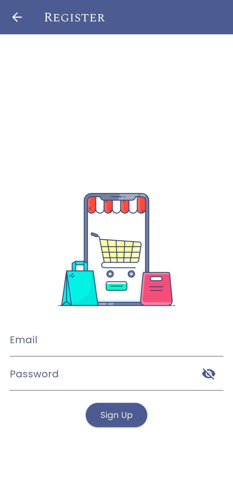
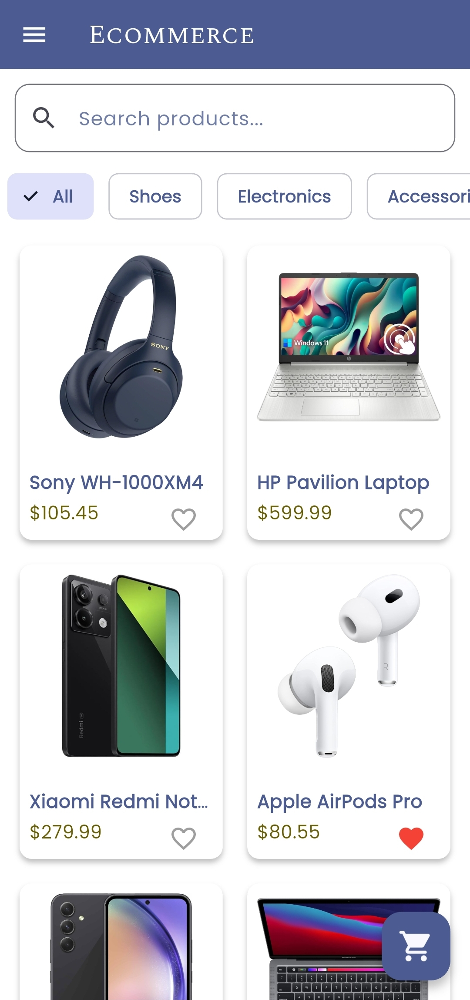
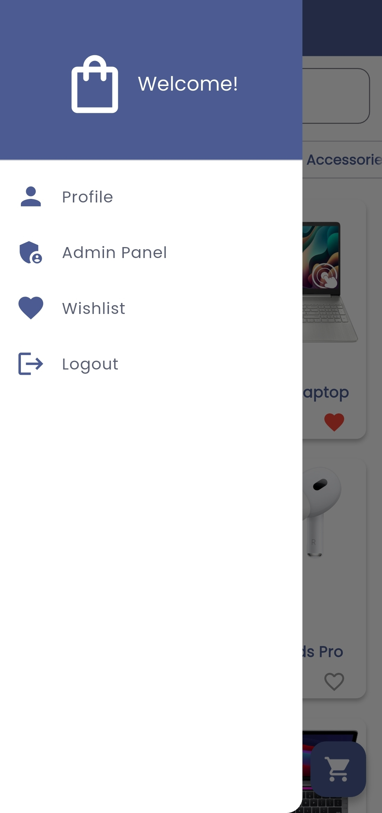
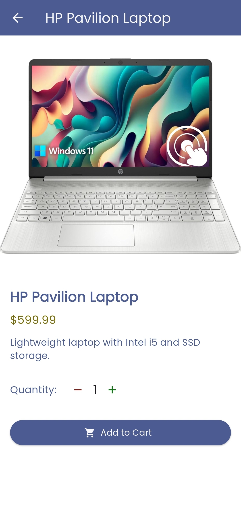
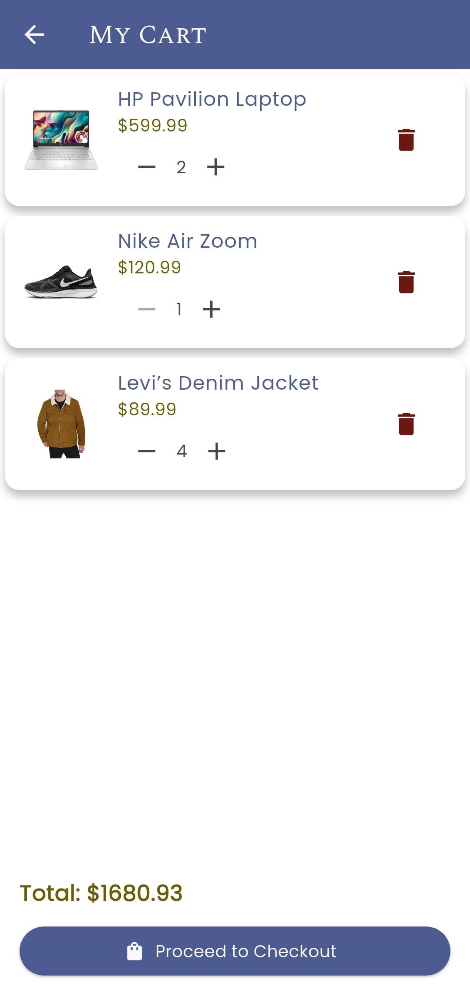
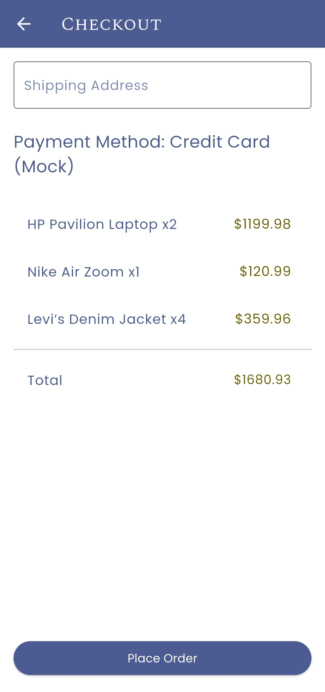
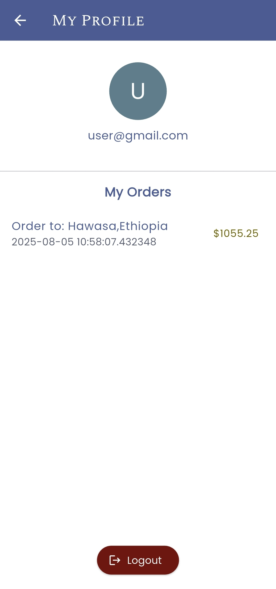
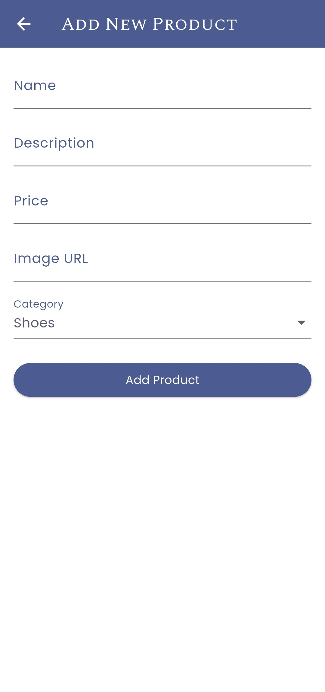
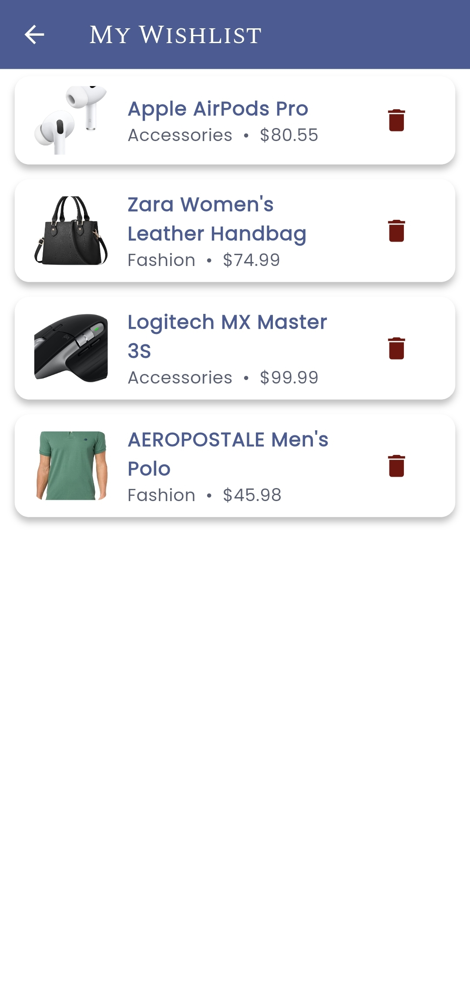

🛍️ E-Commerce Flutter App

A modern and fully functional 'E-Commerce mobile application' built using Flutter, Firebase, and Riverpod state management. This app supports user authentication, product browsing, cart, wishlist, checkout, and admin product management features.

---

1.Features

=> 👤 User Side:

-  User Registration & Login (with Firebase Auth)
-  Product Listing & Details
-  Add to Wishlist
-  Add to Cart, Quantity Update, Remove
-  Checkout with order confirmation
-  Order History
-  Profile Page with Logout

=> 🔧 Admin Panel:

-  Admin-only access
-  Add Products (title,description, price, category, image URL)
-  Secured with role-based access

---

2. 📸 Screenshots

  Login Screen

 Register Screen

  Home Page

 Sidebar(drawer)

 Product Detail Page

 Cart Page

 Checkout Page

 Profile Page

  Admin Panel

 Wishlist Page

---

3. Tech Stack

- Flutter 3.0+
- Firebase (Auth, Firestore, Storage, Messaging)
- Riverpod (for state management)
- Google Fonts for UI design
- Material Design + Theme customization

---

4. Installation

* Prerequisites
- Flutter SDK installed
- Firebase Project setup (with Android support)
- Emulator or physical Android device

* Steps
1. Clone this repo:
git clone https://github.com/your-username/e_commerce_flutter_app.git
cd e_commerce_flutter_app

2.Install dependencies:
  flutter pub get

3.Configure Firebase:
Add your google-services.json to /android/app/
Enable Firebase Auth, Firestore, Messaging, Storage

4.Run the app:
 flutter run

 📂 Project Structure Highlights
 
 lib/
 ├── models/
 ├── providers/
 ├── repositories/
 ├── screens/
 ├── widgets/
 └── main.dart

* Admin Access
To enable admin access:
 - Go to Firestore → Users collection → Find the user document.
 - Add a role field with value: "admin"
Only users with role: "admin" can access the admin panel.

* Deployment (APK)
   1. Run
      flutter build apk --release
   2. Find the APK at:
      build/app/outputs/flutter-apk/app-release.apk

Contact
If you'd like to collaborate, hire, or ask questions:

Ebrahim Ahmed
📧 [ebrahimahmed804853@gmail.com]
🔗 [Github (https://github.com/ebroahmed/)]    

Star ⭐ the repo if you found it helpful!
